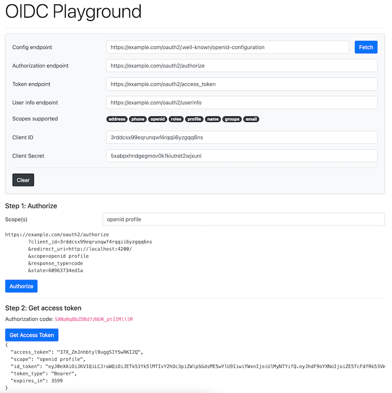

# OIDC and OAuth2 Playground

This project comes with a UI and a proxy server and its purpose
is to test OAuth2 (and OpenID Connect) authorization flows.

At the moment only the authorization code flow is supported.

The authorization server you are testing against may not be available
on the internet, hence the need for a tool you can run locally.
Also, OAuth2 playgrounds out there don't work that well.

## Running the app

To start both the proxy server and the UI, run `npm start` and then go to 
http://localhost:4200/.
(You will need Node.js and the dependencies installed with `npm install`)
A Dockerized version of this app will be coming soon.

## Example
 

